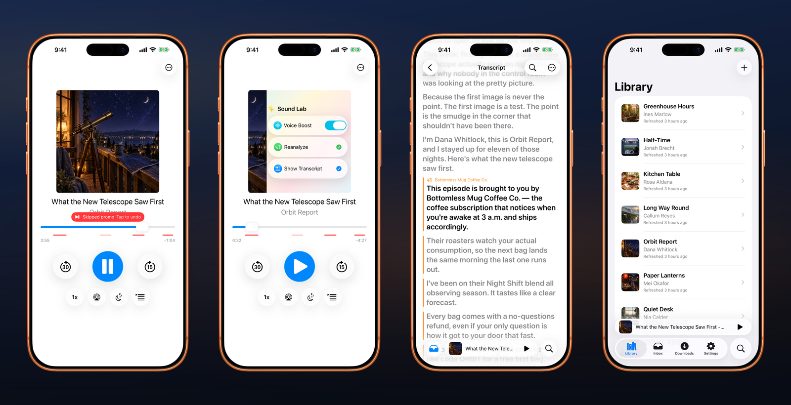

# the open source podcast app that skips the ads

**opencast** is a native iPhone and iPad podcast app. Your phone transcribes an episode, opencast finds the ad breaks in the transcript and skips them, and one tap undoes a skip. It is free, and it works with any RSS feed.

no account. no tracking. no ads of our own. **your listening is not a growth funnel.**

<p>
  <a href="https://apps.apple.com/us/app/opencast/id6766770733"></a>
</p>

[](https://github.com/connlark/opencast/actions/workflows/apple-ci.yml) [](https://github.com/connlark/opencast/actions/workflows/server-ci.yml)
## why opencast

| skips the ads | yours |
| :--- | :--- |
| **Transcribed on your phone.** Download an episode and opencast transcribes it on device with Apple Speech or Whisper, then marks every promo and sponsor read on the timeline and in the transcript. | **No account, no tracking.** No opencast login, no analytics SDK, no ads of our own. Subscriptions and progress sync through your private iCloud when you turn it on. |
| **Skipped, with an undo.** High-confidence breaks skip automatically and a small red pill says "Skipped promo. Tap to undo." Borderline sponsor reads are marked, never skipped. | **Any RSS feed.** Find a show in the directory or paste its feed URL. Nothing between you and your subscriptions rearranges them. |
| **Reads the episode.** Tap-to-seek transcripts with follow-along highlighting, full-text search across everything ever said in your library, generated chapters and summaries (optional, paid), and Voice Boost. | **Native and small.** SwiftUI on iOS 26, CarPlay and Siri, Up Next, sleep timer, per-show intro and outro skip, OPML, downloads. About 10 MB. MIT-licensed. |



## Privacy, plainly

opencast has no ads, tracking SDKs, or account sign-in. Subscriptions and listening progress can sync through your private iCloud database; caches and downloads remain on your device.


Read the [plain-language privacy policy](https://support.opencast.mobile/privacy) for more.

## Build from source

You will need macOS, Xcode 26 or later, Swift 6.3, and an iOS 26 simulator.

```zsh
git clone https://github.com/connlark/opencast.git
cd opencast
open opencast.xcodeproj
```

Select the `OpenCast` scheme, choose an iPhone or iPad running iOS 26, and press Run. A simulator build does **not** require a Cloudflare deployment: RSS, the local library, playback, downloads, Voice Boost, and local persistence are all part of the app checkout.

The public repository is deliberately sanitized. Server-backed features point to placeholder endpoints, so notifications, ad analysis, model delivery, purchases, and remote transcription require services you operate and configure yourself.

<details>
<summary><strong>Running on a physical device</strong></summary>

Use your own Apple development team and unique bundle identifiers for the app and both notification extensions. Update the iCloud container to one your team controls and enable Siri for the App ID and provisioning profile. CarPlay audio is granted by Apple per team; remove `com.apple.developer.carplay-audio` from the selected entitlements file if your team does not have it.

</details>

## Project map

| Area | What lives there |
| --- | --- |
| [`OpenCast/`](OpenCast/) | SwiftUI app, SwiftData stores, playback and feature UI, resources, and platform integrations |
| [`OpenCastNotificationService/`](OpenCastNotificationService/) and [`OpenCastNotificationContent/`](OpenCastNotificationContent/) | Rich new-episode notification extensions |
| [`OpenCastCore`](Packages/OpenCastCore/) | Podcast domain types, RSS parsing, feed identity, and directory search |
| [`OpenCastPlayback`](Packages/OpenCastPlayback/) | AVFoundation playback, remote commands, and Voice Boost integration |
| [`OpenCastTranscription`](Packages/OpenCastTranscription/) | Apple Speech and vendored WhisperKit transcription support |
| [`OpenCastVoiceBoost`](Packages/OpenCastVoiceBoost/) | Native Swift/C voice-processing library and lab tools |
| [`Server/`](Server/) | Optional Cloudflare Workers and the opencast marketing/support site |

The app is intentionally native-first: SwiftUI, Observation, SwiftData, AVFoundation, MediaPlayer, CloudKit, and first-party DSP. The Swift code uses Swift 6 strict concurrency.

## Optional services

Every public Worker configuration is a disabled, self-hostable template.

| Capability | Setup guide |
| --- | --- |
| New-episode notifications | [`NotificationsWorker`](Server/NotificationsWorker/README.md) |
| Transcript-based ad analysis | [`AdAnalysisWorker`](Server/AdAnalysisWorker/README.md) |
| Transcript chapters and summaries | [`TranscriptAnalysisWorker`](Server/TranscriptAnalysisWorker/README.md) |
| Whisper model manifests and assets | [`ModelGatewayWorker`](Server/ModelGatewayWorker/README.md) |
| Remote transcription | [`RemoteTranscriptionWorker`](Server/RemoteTranscriptionWorker/README.md) and [`TranscriptionMediaWorker`](Server/TranscriptionMediaWorker/README.md) |
| Remote-transcription purchases | [`PurchaseWorker`](Server/PurchaseWorker/README.md) |
| Marketing, support, and privacy site | [`Website`](Server/Website/README.md) |

## Contributing

Issues and pull requests are welcome!

Need help using the app? Visit [support.opencast.mobile](https://support.opencast.mobile). For bugs and feature ideas, [open an issue](https://github.com/connlark/opencast/issues)!

## License

opencast is available under the [MIT License](LICENSE). _Vendored components retain their own attribution and license files._
